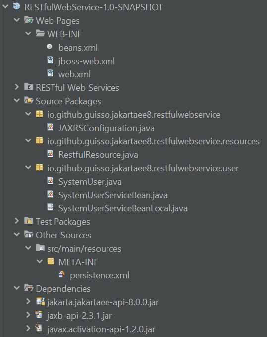

# WebServiceJAXRSSystemUser
A Jakarta EE JAX-RS web service prototype for didact purposes.

## URIs for tests

- *Records with ids 9001 and 1 are required*.
* http://127.0.0.1:8080/ws/api/resources/user/9001, GET with header "Accept: text/plain".
* http://127.0.0.1:8080/ws/api/resources/user/9001, GET with header "Accept: application/json".
* http://127.0.0.1:8080/ws/api/resources/user/9001, GET with header "Accept: application/xml".
* http://127.0.0.1:8080/ws/api/resources/user/9001/json, GET.
* http://127.0.0.1:8080/ws/api/resources/user/9001/xml, GET.
* http://127.0.0.1:8080/ws/api/resources/user/My+Name+Here/mynamehere@mail.com/asdf, POST.
* http://127.0.0.1:8080/ws/api/resources/user/1/My+Name+Surname+Here/mynamesurnamehere@mail.com/asdfg123456, PUT.
* http://127.0.0.1:8080/ws/api/resources/user/1, DELETE.

## Suggested analysis order

1. [pom.xml](/pom.xml)
2. [jboss-web.xml](/src/main/webapp/WEB-INF/jboss-web.xml)
3. [persistence.xml](/src/main/resources/META-INF/persistence.xml)
4. [SystemUser.java](/src/main/java/io/github/guisso/jakartaee8/restfulwebservice/user/SystemUser.java)
5. [SystemUserServiceBeanLocal.java](/src/main/java/io/github/guisso/jakartaee8/restfulwebservice/user/SystemUserServiceBeanLocal.java)
6. [SystemUserServiceBean.java](/src/main/java/io/github/guisso/jakartaee8/restfulwebservice/user/SystemUserServiceBean.java)
7. [JAXRSConfiguration.java](/src/main/java/io/github/guisso/jakartaee8/restfulwebservice/JAXRSConfiguration.java)
8. [RestfulResource.java](/src/main/java/io/github/guisso/jakartaee8/restfulwebservice/resources/RestfulResource.java)

## Reference

* *The source code shown here conforms to Jakarta EE 8*.

The Jakarta EE 9 Tutorial: Introduction to Web Services

<https://eclipse-ee4j.github.io/jakartaee-tutorial/#introduction-to-web-services>

The Jakarta EE 9 Tutorial: Building RESTful Web Services with Jakarta REST

<https://eclipse-ee4j.github.io/jakartaee-tutorial/#building-restful-web-services-with-jakarta-rest>
