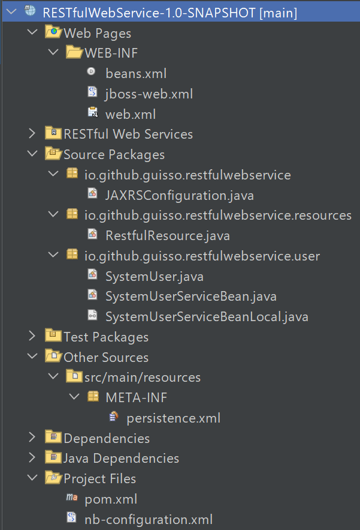

# WebServiceJAXRSSystemUser
A Jakarta EE JAX-RS web service prototype for didact purposes.

## URIs for tests

- *Records with ids 1 and 2 are required*.

* http://127.0.0.1:8080/ws/api/resources/user/My+Name+Here/mynamehere@mail.com/asdf, POST.
* http://127.0.0.1:8080/ws/api/resources/user/Another+Name+Here/anothernamehere@mail.com/123456, POST.
* http://127.0.0.1:8080/ws/api/resources/user/1, GET with header "Accept: text/plain".
* http://127.0.0.1:8080/ws/api/resources/user/1, GET with header "Accept: application/json".
* http://127.0.0.1:8080/ws/api/resources/user/1, GET with header "Accept: application/xml".
* http://127.0.0.1:8080/ws/api/resources/user/1/xml, GET.
* http://127.0.0.1:8080/ws/api/resources/user/2/xml, GET.
* http://127.0.0.1:8080/ws/api/resources/user/2/My+Name+Surname+Here/mynamesurnamehere@mail.com/asdfg123456, PUT.
* http://127.0.0.1:8080/ws/api/resources/user/2, GET with header "Accept: application/json".
* http://127.0.0.1:8080/ws/api/resources/user/2, DELETE.

## Suggested analysis order

1. [pom.xml](/pom.xml)
2. [jboss-web.xml](/src/main/webapp/WEB-INF/jboss-web.xml)
3. [persistence.xml](/src/main/resources/META-INF/persistence.xml)
4. [SystemUser.java](/src/main/java/io/github/guisso/jakartaee8/restfulwebservice/user/SystemUser.java)
5. [SystemUserServiceBeanLocal.java](/src/main/java/io/github/guisso/jakartaee8/restfulwebservice/user/SystemUserServiceBeanLocal.java)
6. [SystemUserServiceBean.java](/src/main/java/io/github/guisso/jakartaee8/restfulwebservice/user/SystemUserServiceBean.java)
7. [JAXRSConfiguration.java](/src/main/java/io/github/guisso/jakartaee8/restfulwebservice/JAXRSConfiguration.java)
8. [RestfulResource.java](/src/main/java/io/github/guisso/jakartaee8/restfulwebservice/resources/RestfulResource.java)

## Reference

* *The source code shown here conforms to Jakarta EE 10*.

The Jakarta EE 10 Tutorial: Introduction to Web Services

[Introduction to Web Services>](https://jakarta.ee/learn/docs/jakartaee-tutorial/current/websvcs/rest/rest.html)
